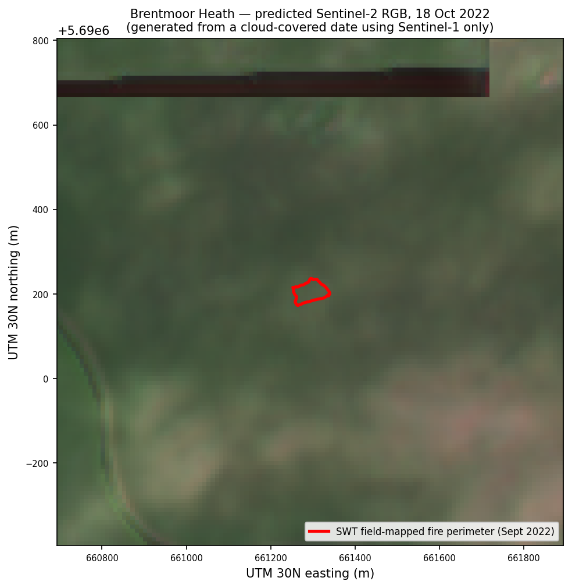
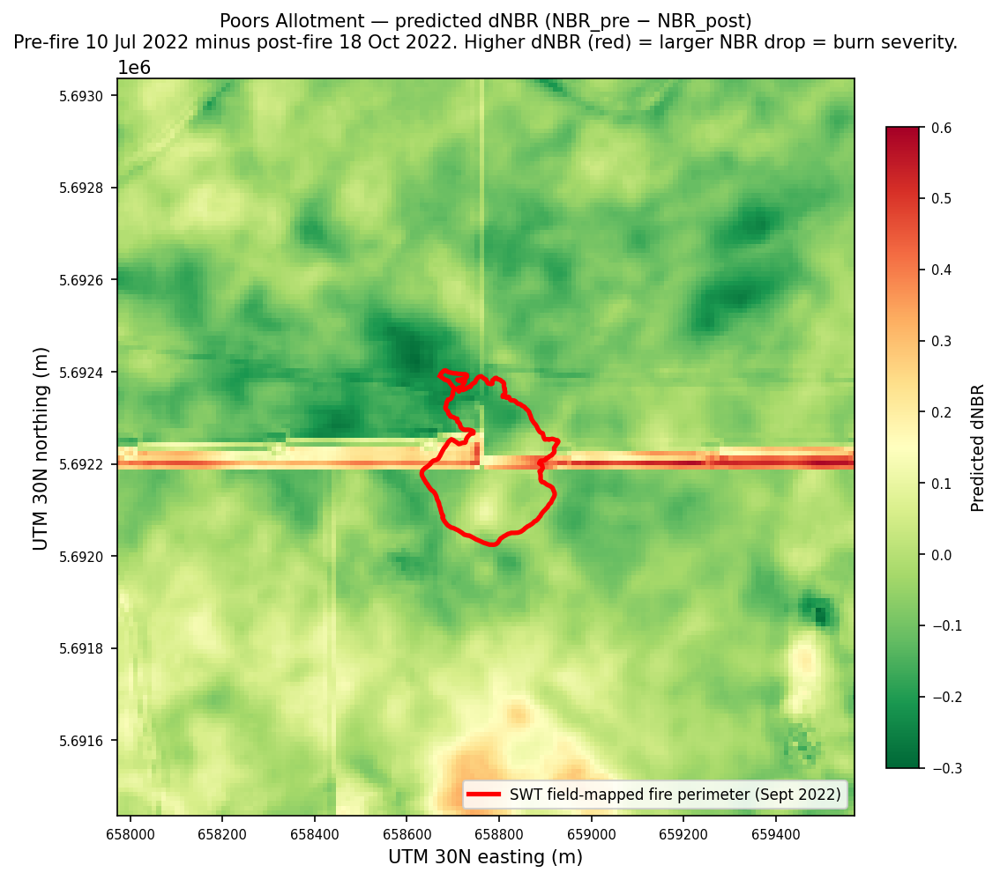
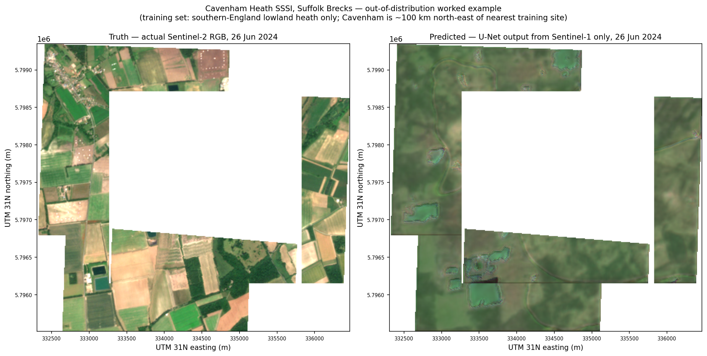
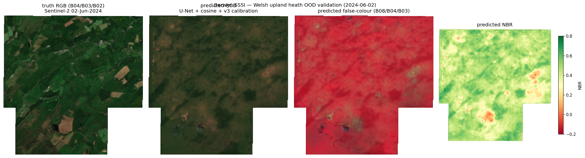

# Operational deployment — `gee_s1s2_translator`

This document is written for **wildlife protection officers, conservation
NGO staff, and similar operationally-motivated readers** who want to know:
what this tool does, whether it's likely to work for their site, what it
will cost, and how to deploy it. It is deliberately not academic — the
methodology paper is in `docs/`, the dissertation grew this work, and the
reference numbers live in `validation_report.md`.

If you came here looking for "I have a heath that burned, can I see the
damage map even though it's been raining for three weeks?", read on.

---

## What this tool produces

Two figures from real Surrey Wildlife Trust fire sites in 2022. Both
fires happened in late August / early September; the Sentinel-2 optical
image of the immediate post-fire window is cloud-covered and unusable.
The figures below are predicted from the matching cloud-penetrating
Sentinel-1 radar acquisition. The red outline in each is SWT's
field-mapped perimeter, surveyed on the ground.



*RGB composite — Brentmoor Heath, predicted from the 18 Oct 2022
Sentinel-1 acquisition. The 0.33 ha burn site sits near the centre of
the frame, visibly different from the surrounding unburnt heath.*



*Predicted dNBR — Poors Allotment (6.79 ha burn). Pre-fire NBR (10 Jul
2022, peak summer growth) minus post-fire NBR (18 Oct 2022). Red /
orange = larger NBR drop = higher burn severity. The SWT field-mapped
perimeter (red line) sits over a clear positive-dNBR region.*

dNBR is the standard burn-severity metric. **Honest caveats from the
validation report:** the model smooths high-frequency variance below
the operational 75 % bracket on three of four driver bands, so the
predicted dNBR is muted compared to what real Sentinel-2 dNBR would
show. The signal is still operationally useful for *perimeter
delineation* with a re-calibrated threshold; it is less useful for
*severity classification* until variance retention is improved (see
[Limitations](#limitations) and the threshold-calibration recipe in
"How to interpret the outputs"). The horizontal red stripe in the
Poors panel is a patch-boundary mosaic artefact, not a real fire
signal.

---

## Worked examples on fresh sites

Two demonstrations that the model produces sensible predicted
reflectance on UK heath sites **outside its training distribution**.
The first is **Cavenham Heath SSSI** (Suffolk Brecks, ~100 km OOD,
heath / arable mosaic). The second is **Berwyn SSSI** (north Wales,
~250 km OOD, upland heath / blanket bog at 400-700 m elevation,
oceanic-margin climate). Both AOIs were defined as 2 000 m point-
buffers; harvest + inference run end-to-end via the operator-facing
scripts (Workflows 3 and 1 below).

### Worked example 1 — Cavenham Heath SSSI, Suffolk Brecks



The predicted RGB (right) is recognisably the same landscape as the
truth Sentinel-2 image (left): field boundaries, the heath / arable
mosaic, scattered woodland all show in the right places. The prediction
is lower-contrast and slightly flattened — the model smooths
high-frequency texture, consistent with the variance-retention
caveat noted above. Full breakdown in
[training/WORKED_EXAMPLE_CAVENHAM.md](training/WORKED_EXAMPLE_CAVENHAM.md).

### Worked example 2 — Berwyn SSSI, north Wales (upland heath)



The predicted RGB (second panel) is recognisably the same landscape
as the truth Sentinel-2 image (left): field boundaries on the lower
edge, the lighter moorland patches, the darker meadow blocks all map
across cleanly. The prediction is visibly flatter and lower-contrast
than the truth, but the spatial layout is intact and the NBR panel
shows variation matching the truth panel's lighter / darker zones.
Full breakdown in
[training/WORKED_EXAMPLE_BERWYN.md](training/WORKED_EXAMPLE_BERWYN.md).

### Three-OOD-site comparison

The transfer claim now rests on three OOD sites: Ashdown Forest
(East Sussex, geologically-distinct training-region site, in-test-
split OOD), Cavenham Heath (Suffolk Brecks, ~100 km OOD), and
Berwyn (north Wales, ~250 km OOD). Driver bands are B04 / B08 /
B11 / B12; the operational pass bracket is 75-105 % variance
retention.

| Band | Berwyn MAE | Berwyn var | Cavenham MAE | Cavenham var | Ashdown MAE | Ashdown var |
| --- | ---: | ---: | ---: | ---: | ---: | ---: |
| B02 | 0.012 | 45 % | 0.023 | 31 % | 0.015 | 48 % |
| B03 | 0.013 | 50 % | 0.035 | 34 % | 0.018 | 55 % |
| B04 ⓓ | 0.028 | **64 %** | 0.053 | 21 % | 0.021 | 43 % |
| B08 ⓓ | 0.126 | 31 % | 0.093 | **71 %** | 0.093 | 60 % |
| B11 ⓓ | 0.039 | **79 %** ✓ | 0.088 | 60 % | 0.042 | 63 % |
| B12 ⓓ | 0.041 | **79 %** ✓ | 0.097 | 28 % | 0.030 | 56 % |
| **Driver mean** | — | **63 %** | — | 45 % | — | 55 % |
| **Overall MAE** | **0.043** | — | 0.065 | — | ~0.030 | — |

ⓓ = driver band. ✓ = passes the operational [75-105 %] bracket.

**Operational viability transfers across all three sites for
perimeter delineation** — the predicted RGB reads as the right
landscape at every OOD site, and at Berwyn two driver bands
(B11, B12) reach the operational variance bracket. **B08 (NIR)**
behaves region-specifically: it reaches the bracket at Hankley
Common in-distribution and at Cavenham (71 %), but degrades to
31 % at Berwyn. **Severity classification and absolute reflectance
need local recalibration in every new region** — the median-
ratio biases are different at each site (Berwyn over-predicts
B04 by 81 %, under-predicts B08 by 24 %; Cavenham collapses B04
and B12 hard) and dNBR thresholds calibrated on southern-England
training data do not transfer cleanly to either OOD region.

### Operational note: spatial homogeneity, not geographic distance

The pattern across three OOD sites suggests transfer performance
correlates with target landscape spatial homogeneity rather than
geographic distance from the training set. Spatially-homogeneous
upland heath at Berwyn (250 km OOD) transfers better than
heterogeneous heath/arable mosaic at Cavenham (100 km OOD)
because the model's variance-retention floor matches homogeneous
targets better. Operational implication: this tool is more
reliable for sites with broadly uniform vegetation cover than for
fragmented landscapes.

**Operational read across both examples:** the model is credible
for perimeter delineation at fresh UK heath sites in both lowland
and upland regimes without re-training. Absolute reflectance and
severity classification need local threshold re-calibration in
every new region, or a re-train including the regime explicitly
(Workflow 4 below, ~£1 and one day's work per regime).

## What this tool does

`gee_s1s2_translator` is a deep-learning model that **predicts what a
Sentinel-2 optical image of a UK lowland heath would look like, from a
Sentinel-1 radar image of the same scene**. Sentinel-1 sees through
clouds. Sentinel-2 doesn't. So the model lets you reason about heath
vegetation state — including post-fire scarring — on dates where the only
real Sentinel-2 image available is a flat grey cloud sheet.

The output is a 9-band GeoTIFF: six predicted Sentinel-2 reflectance
bands (B02, B03, B04, B08, B11, B12), plus the three derived indices
NDVI, NBR, NDWI computed from them. NBR is typically the most informative
band for heath fire damage; threshold it the same way you'd threshold a
real Sentinel-2 NBR raster.

## What use cases it solves

The motivating use case: **mapping fire scar boundaries on lowland heath
when cloud cover prevents direct Sentinel-2 observation.** Lowland heath
fire seasons are getting longer in the UK, and Atlantic-margin
weather means useful post-fire optical imagery is the exception rather
than the rule. Field-mapping a perimeter with GPS is excellent ground
truth but slow and resource-intensive; this tool augments it by giving
operators a quick desk-side approximation of what NBR-thresholded fire
scar maps would show on cloud-covered dates.

The same pattern transfers to:

- **Vegetation recovery monitoring** through cloudy autumns and winters
- **Pre-fire condition snapshots** when a fire is already underway and
  the most recent cloud-free Sentinel-2 is weeks old
- **Comparing damage extent** between a known-healthy spring scene and a
  predicted post-fire scene, even when the post-fire date has no usable S2

It is a translation tool, not a classifier. It does not output
"burned / not burned" labels — you make that call by thresholding the
predicted reflectance bands or the predicted NBR, the same way you would
on a real Sentinel-2 image. The validation report quantifies how close
the predicted bands come to truth on a held-out test set; the answer is
"close enough to be useful for thresholding, with the caveats below."

## Step zero — first-time setup

Aimed at: an officer who has never deployed cloud infrastructure before.
Plan ~30 minutes for first-time setup; subsequent runs take <5 minutes
per AOI.

### 0.1 Create a Google Cloud account

1. Go to <https://console.cloud.google.com/>. Sign in with a personal
   or organisation Google account.
2. Accept the terms and create a new project. Name it something
   descriptive, e.g. `wildlife-mapping`. Note the **project ID** Google
   assigns — you'll use this everywhere as `GEE_S1S2_PROJECT_ID`.
3. **Enable billing.** Yes, even for free-tier work — Google requires a
   payment method on file before you can use most APIs. A credit or
   debit card is required. New accounts include £230 of free credit
   that more than covers the costs in this doc.
4. Set a billing alert (3 minutes, see [billing alert recipe](#set-a-billing-alert) below) to protect against runaway cost.

### 0.2 Install the gcloud CLI

The `gcloud` command-line tool lets your terminal talk to Google Cloud.
Install per the official instructions for your OS:
<https://cloud.google.com/sdk/docs/install>.

After install, verify with `gcloud --version`.

### 0.3 Authenticate

Two separate auth flows are needed:

```bash
# Interactive login that scripts inherit (opens a browser)
gcloud auth login

# Application Default Credentials — used by Python SDKs in this repo
gcloud auth application-default login

# Tell gcloud which project to act on
gcloud config set project YOUR_PROJECT_ID
```

### 0.4 Register for Earth Engine

Free for non-commercial use. Sign up at
<https://signup.earthengine.google.com/>. Approval is usually fast
(minutes to hours). Use the same project ID you created above when
prompted.

### 0.5 Clone the repo and install the Python package

```bash
git clone https://github.com/marcusbsorensen/gee_s1s2_translator.git
cd gee_s1s2_translator
python3 -m venv .venv
source .venv/bin/activate
pip install -e .
```

(On Windows: `.venv\Scripts\activate` instead of `source .venv/bin/activate`.)

### 0.6 Set the required environment variables

Copy this block into your shell, swapping in your project ID and bucket
name (you'll create the bucket in step 0.8 below):

```bash
export GEE_S1S2_PROJECT_ID="your-project-id"
export GEE_S1S2_BUCKET="your-bucket-name"
export GEE_S1S2_PREFIX="gee_s1s2_translator/operational_v1"
export GEE_S1S2_LOCATION="europe-west2"
```

Persist these by adding the lines to `~/.bashrc` or `~/.zshrc` if you
want them set in every new terminal.

### 0.7 Request the T4 GPU quota

Vertex AI's default T4 GPU quota for new projects is 0; you need at
least 1 to run training or inference. The path:

1. Console → **IAM & Admin** → **Quotas & System Limits**.
2. Filter the table by name: `Custom model training Nvidia T4 GPUs per region`.
3. Filter dimensions: `region:europe-west2` (or whichever region you chose).
4. Tick the row's checkbox → click **Edit**.
5. New value: `3` (lets you run two training jobs in parallel with one in
   reserve; pick `1` if you only ever expect to run a single job at a time).
6. Justification text — this works:
   > Training and inference for a remote-sensing model used in lowland-heath wildfire mapping. Non-commercial conservation work.
7. Click **Submit request**.

Approval is usually automatic within minutes for value 1–3 requests.
You'll receive an email confirmation. Once approved, you can submit
training and inference jobs (further down this doc).

### 0.8 Create a Cloud Storage bucket

1. Console → **Cloud Storage** → **Buckets** → **Create**.
2. Name: globally unique. A safe pattern: `<your-org>-fire-mapping`.
3. Location type: **Region**, value `europe-west2` (must match
   `GEE_S1S2_LOCATION` so compute and storage are co-located).
4. Storage class: **Standard**.
5. Access control: **Uniform**.
6. **Public access prevention**: enforced (default; leave it on).
7. Create.

Set `GEE_S1S2_BUCKET` to the name you picked.

### Set a billing alert

Cloud Billing → **Budgets and Alerts** → **Create**. Suggested default:
£10/month, email alerts at 50 %, 90 %, and 100 % of budget. This
protects against runaway costs from (e.g.) a forgotten endpoint left
running.

---

## What it requires to deploy

A working operational deployment needs five things, all free or
trivially-priced for the scale this tool runs at:

1. **Google Cloud account.** A free-tier account with billing enabled
   (no credit needed up front). All compute and storage runs in your
   own GCP project.
2. **Earth Engine non-commercial registration.** Free. Sign up at
   <https://signup.earthengine.google.com>. Approval is fast for
   non-commercial users. Once approved, the project ID you register is
   what the harvest pipeline uses.
3. **Google Cloud Storage bucket.** One bucket in a single region (we
   use `europe-west2` because that's where our compute runs; pick a
   region close to your AOIs to minimise data transfer). Free-tier
   storage covers comfortably more than this tool produces.
4. **Vertex AI T4 GPU quota of 1.** Vertex's default for new projects
   is 0; you need to request `Custom model training Nvidia T4 GPUs
   per region` raised to 1 in your chosen region. Approval is usually
   automatic and within minutes for value-of-1 requests. The project's
   training and inference runs all use a single T4 at a time.
5. **A list of AOIs (areas of interest) you care about.** Either a KML
   file with each fire perimeter or heath polygon, or simple lat/lng
   centre points with a buffer radius. Any GIS tool can produce these.

That's it. No on-prem GPUs, no commercial licences, no data sharing
agreements. The model weights and code are MIT-licensed (see below).

## What it costs to operate

Concrete numbers from the project's actual deployment, May 2026:

| Step | Vertex AI compute | Wall-clock | Cost (£) |
| --- | --- | ---: | ---: |
| Train model from scratch on a fresh AOI set | Custom Job, 1× T4 on n1-standard-4 | ~20 min | £0.30–0.60 |
| Phase 1 harvest (one-off + per new AOI) | Custom Job, n1-standard-4 CPU | ~1.5–2.5 h | £0.30–0.50 |
| Single inference run over 3 AOIs | Custom Job, 1× T4 | ~3 min | £0.02 |
| Vertex AI Endpoint, *while running* | n1-standard-2 + 1× T4 | per hour | £0.20–0.50 |
| GCS storage for harvested patches | per GB-month | per month | <£0.05 |

**Headline:** training a model and running inference is well under £1.
The cost lever is the Vertex AI Endpoint — it bills by the hour while
deployed, even when no one's calling it.

**Operational recommendation: deploy-and-tear-down rather than always-on.**
A typical NBR-threshold workflow needs the endpoint for ~10 minutes total
(deploy → predict → tear down), so the marginal cost is pennies. Leaving
an endpoint running 24/7 for a year is ~£1,750–4,400 — only worth it if
you're running predictions multiple times per hour across many sites.

The repo's training README documents the offline-inference path
(`predict_aois.py` as a Vertex Custom Job) which avoids endpoint costs
entirely and is the right choice for batch evaluation.

## How to deploy

Pick the workflow that matches what you're trying to do:

| What you want | Workflow | Cost (one run) |
| --- | --- | ---: |
| Map a small number of fire sites in batches | **Workflow 1** — inference-as-a-job | ~£0.02 |
| Real-time prediction over an API (e.g. for a custom QGIS plugin) | **Workflow 2** — Vertex AI Endpoint *(see caveats)* | £0.20–0.50/h while running |
| Adapt the harvest to a new AOI or window | **Workflow 3** — config edit + re-run harvest | ~£0.30 |
| Re-train the model on a different region | **Workflow 4** — fresh training run | £0.30–0.60 |

### Workflow 1: predict over our existing AOIs

If your AOIs overlap with the project's existing harvest (Brentmoor
Heath, Poors Allotment, the Surrey/New Forest/Dorset training sites, or
Ashdown Forest), the trained model is already published and you can
predict directly.

```bash
# Default: predict over the project's three example sites.
python scripts/submit_predict_aois.py

# A specific target — e.g. Brentmoor on the 8 Oct 2022 cloud-covered date:
python scripts/submit_predict_aois.py \
    --target brentmoor-area-training:20221008:postfire \
    --output-subdir post_fire_2022
```

Outputs go to `gs://<bucket>/<prefix>/models/v2_equivalent_initial/predictions/unet/[<subdir>/]`.

### Workflow 2: real-time prediction via Vertex AI Endpoint

Use this only if you have an interactive use case (custom UI, QGIS
plugin) that needs sub-second response. The endpoint costs by the hour
while deployed; for batch evaluation, Workflow 1 is dramatically
cheaper. See the [endpoint caveat below](#a-note-on-online-inference-vertex-ai-endpoints).

### Workflow 3: harvest a new AOI or new window

Edit `config/operational_v1.yaml`, add your AOI under `aois:` (example
shape):

```yaml
aois:
  - name: "Your Site Name"
    role: target               # or "training" if you intend to retrain
    source:
      type: kml
      path: ../inputs/your_site.kml
```

Then run the harvest:

```bash
# Local CLI (small AOI, fast)
python -m gee_s1s2.cli harvest --aoi "Your Site Name"

# Or as a Vertex Custom Job (recommended for >30 min runs or
# multiple AOIs in one shot)
python scripts/submit_post_fire_harvest.py \
    --aoi "Your Site Name" \
    --window "post-fire 2022"
```

Then run inference as in Workflow 1.

### Workflow 4: re-train on a different region

Only needed if your sites are far enough away from southern England
that vegetation phenology or S1 calibration regimes differ materially
(e.g. Scottish blanket bog, Mediterranean garrigue). This step is
"single-day work for an analyst familiar with GCP" — open a GitHub
issue if you'd like a hand. The mechanics:

1. Add new AOIs (yours plus a held-out test AOI in the same regional
   biome) under `aois:`.
2. Run Phase 1 harvest to populate `gs://<bucket>/<prefix>/patches/`.
3. Train: `python scripts/submit_vertex_training.py --run-name my_first_retrain`. Expected ~£0.30–0.60.
4. Validate against your held-out AOI; compare to the baseline metrics
   in `models/<run_name>/validation_report.md`.

## A note on online inference (Vertex AI Endpoints)

The default operational path is Workflow 1 (Vertex Custom Job calling
`training.predict_aois`) — it reads patches from GCS, runs inference once,
writes GeoTIFFs back, and exits. No standing infrastructure, no idle costs.

`training/src/training/deploy_endpoint.py` also stands up a real-time
Vertex AI Endpoint (deploy → test → teardown all in one job, with cleanup
in `try/finally` so an endpoint cannot be left running by mistake). This
was exercised end-to-end during build-out: model upload, endpoint create,
deploy, prediction request, undeploy, delete. **One caveat to be aware of
if you adopt online inference**: Vertex enforces a 1.5 MB request body cap
on both `predict()` and `raw_predict()` for dedicated endpoints, and a
single 256×256×2 float32 patch JSON-encodes to ~2.8 MB. To send full-tile
inputs to a deployed endpoint you need either Batch Prediction (GCS-mounted
inputs, no body cap) or a private endpoint configuration with raised
limits. Inference-as-a-job (Workflow 1) sidesteps this entirely and is
what we recommend for batch workflows; the endpoint path is there if you
need sub-second response latency for an interactive tool.

## How to interpret the outputs

Each predicted GeoTIFF is 9 bands, in this order:

| Band | Name | Meaning | Operational use |
| ---: | --- | --- | --- |
| 1 | B02 | Sentinel-2 blue (492 nm) | Atmospheric reasoning, water |
| 2 | B03 | Sentinel-2 green (560 nm) | Live vegetation, water |
| 3 | B04 | Sentinel-2 red (665 nm) | Bare soil, ash, fire scarring |
| 4 | B08 | Sentinel-2 NIR (842 nm) | Live vegetation chlorophyll |
| 5 | B11 | Sentinel-2 SWIR-1 (1610 nm) | Burnt-area discrimination |
| 6 | B12 | Sentinel-2 SWIR-2 (2190 nm) | Burnt-area discrimination |
| 7 | NDVI | (B08–B04) / (B08+B04) | Live vegetation index |
| 8 | **NBR** | (B08–B12) / (B08+B12) | **Normalised Burn Ratio** |
| 9 | NDWI | (B03–B08) / (B03+B08) | Water/moisture index |

**NBR is the workhorse band for fire-scar mapping**; standard practice
is to threshold pre-fire NBR minus post-fire NBR (`dNBR`) to delineate
the perimeter. The same workflow runs against this tool's outputs as
against real Sentinel-2 — the GeoTIFFs are 10 m UTM rasters,
DEFLATE-compressed, with proper CRS and affine.

**Honest caveat from the validation report:** on the held-out Ashdown
test set, the U-Net retains **55.5 %** of patch-specific reflectance
variance on driver bands (B04 / B08 / B11 / B12) — below the [75 %, 105 %]
operational pass bracket. The pattern is consistent with regression to
the mean: the model finds a smoother solution that minimises absolute
error without preserving high-frequency variance. **This means
NBR-threshold values that are calibrated against real Sentinel-2 may
need re-tuning when applied to predicted Sentinel-2.** The variance
collapse is uniform across our test set, so the right operational
practice is: run dNBR thresholding on a known-good fire perimeter (e.g.
Brentmoor 2022 from this project's predictions) against ground truth,
empirically derive a threshold offset, then apply that offset to new
sites with the same calibration regime.

## Provenance and methodology

The deep-learning component is a 4-level U-Net (~7.8 M parameters) with
bilinear upsampling and a sigmoid output, trained with combined L1 +
0.5 × L2 loss using Adam at 1e-4 and early stopping on validation RMSE.
Architecture is byte-for-byte the v2 PyTorch reference — see
`docs/methodology_divergences.md` for the three documented divergences
between this GEE-port pipeline and the v2 PyTorch + Microsoft Planetary
Computer pipeline:

1. Sentinel-1 calibration uses the Vollrath/Mullissa volumetric
   gamma-naught model in Earth Engine, ~1.5 dB below MPC's ESA range-
   Doppler RTC. Internally consistent and not a bug; documented in
   `docs/calibration_methodology.md`.
2. Held-out Ashdown test count is 105 patches in this run vs the v2
   reference's 76, due to GEE's random-origin sampler with 50 %
   overlap fitting more origins per scene than v2's deterministic grid.
3. T30UWB tile partial-coverage handling at Beaulieu Heath.

Headline numbers from `validation_report.md`:

- Best validation RMSE: **0.0769** at epoch 55 (vs v2 reference 0.1062)
- Driver-band variance retention: 55.5 % (vs v2 58.3 %; both fail
  the 75–105 % operational bracket consistently with each other)
- Per-band Ashdown MAE: B02 0.0151, B03 0.0181, B04 0.0211, B08 0.0929,
  B11 0.0418, B12 0.0302

## Citations and acknowledgements

The Sentinel-1 calibration recipe follows **Mullissa et al. (2021)**,
*"Sentinel-1 SAR Backscatter Analysis Ready Data Preparation in Google
Earth Engine"*, Remote Sensing 13(10), 1954. The Earth Engine
implementation draws on the open `adugnag/gee_s1_ard` repository.

The Sentinel-1 RTC convention difference (Vollrath/Mullissa volumetric
gamma-naught vs ESA range-Doppler) is discussed in **Vollrath, Mleczko,
Tracy (2020)**, *"Angular-Based Radiometric Slope Correction for
Sentinel-1 on Google Earth Engine"*, Remote Sensing 12(11), 1867.

The original v2 PyTorch + MPC reference implementation (`v2_diverse_heath`)
is the methodological starting point for the architectural and loss
choices reproduced here.

The dissertation work that this operational pipeline was built around —
*Lasocki (2026), University of [...], MSc dissertation* — should be
cited if you use this tool for academic publication.

This work was supported by **Surrey Wildlife Trust** field-mapped fire
perimeter data. The two 2022 fire perimeters used as primary inference
targets (Brentmoor Heath, Poors Allotment) are derived from SWT's
mapped fire database.

## Licence

MIT. See `LICENSE`. Forks and contributions are welcome — the
config-driven design is specifically intended to make adapting to new
regions and AOI sets a YAML edit rather than a code fork.

## Limitations

**Honest list. Read this before deploying operationally.**

- **Dataset scale.** The training set is **377 patches** (≈ 24 GB of
  Sentinel-2 imagery, sampled with overlap from 13 training-role AOIs
  in southern England 2021–2024). This is small by deep-learning
  standards. The model generalises within the southern-UK lowland
  heath biome it was trained on; do not expect it to work on Scottish
  blanket bog or Mediterranean garrigue without re-training.
- **Variance retention below the operational floor on driver bands.**
  See the interpretation paragraph above. The practical implication is
  that NBR thresholds need empirical re-calibration per site rather
  than copying values from real-Sentinel-2 thresholding workflows.
- **Single-region calibration.** Sentinel-1 backscatter regimes vary
  with vegetation type, soil moisture climate, and incidence angle.
  This model was calibrated on UK lowland heath at 50–51° N. The
  Vollrath terrain-flattening helps but does not eliminate regime
  differences.
- **Temporal scope.** Training data spans 2021–2024. Cycles longer
  than 4 years (e.g. multi-year drought recovery, decadal succession)
  are not represented in the training set.
- **Cloud-cover override is liberal in the post-fire 2022 window.**
  We accept any S2 scene as the pairing target for that window
  regardless of cloud cover (the operational point — see
  `config/operational_v1.yaml`'s `cloud_cover_override_pct: 100`).
  Predictions from these patches use only the S1 channels and are
  evaluable visually against ground-truth perimeters; quantitative
  per-pixel error against truth is not measurable for cloud-covered
  scenes (truth is hidden behind the cloud).

## Service-account hygiene note

The project uses a dedicated `gee-harvester@<project>.iam.gserviceaccount.com`
service account for the Phase 1 harvest, with `roles/earthengine.writer`
+ `roles/storage.objectAdmin` on the project. The `objectAdmin` role
is project-wide rather than scoped to the bucket prefix; this should be
narrowed to a single-bucket conditional binding before this is treated
as a permanent operational pattern. The current grant is fine for a
single-operator, single-bucket project; it is too broad for a
multi-tenant or shared-bucket scenario.

## Where to go next

- `validation_report.md` — full metrics, per-band breakdowns, v2
  reference comparison
- `docs/methodology_divergences.md` — the three documented divergences
  from the v2 reference and why each one is operationally inert
- `docs/calibration_methodology.md` — S1 calibration recipe rationale
  and validation-against-MPC results
- `training/README.md` — Phase 2 training loop documentation
- `training/v2_reference_results.json` — the v2 PyTorch reference
  numbers we compare against
- `config/operational_v1.yaml` — the YAML that controls the whole
  pipeline; this is where you start when adapting to a new region

---

## Where to ask for help

- **GitHub Issues:** <https://github.com/marcusbsorensen/gee_s1s2_translator/issues>
  is the primary support channel. Please include: the command you ran,
  the full error message, the value of the relevant env vars (mask
  anything secret), and the Vertex job ID if your run reached Vertex.
- **Email:** Sonia Lasocki (project lead, dissertation author) and
  Marcus Sorensen (engineering) — addresses on the GitHub profile pages
  linked from the repo. Please prefer Issues for anything reproducible
  so other operators can find the answer later.

If you're stuck inside the cloud setup (steps 0.1–0.4), Google Cloud
support is faster than we are for billing or auth issues — they have a
free chat tier under Console → ⓘ Help.
